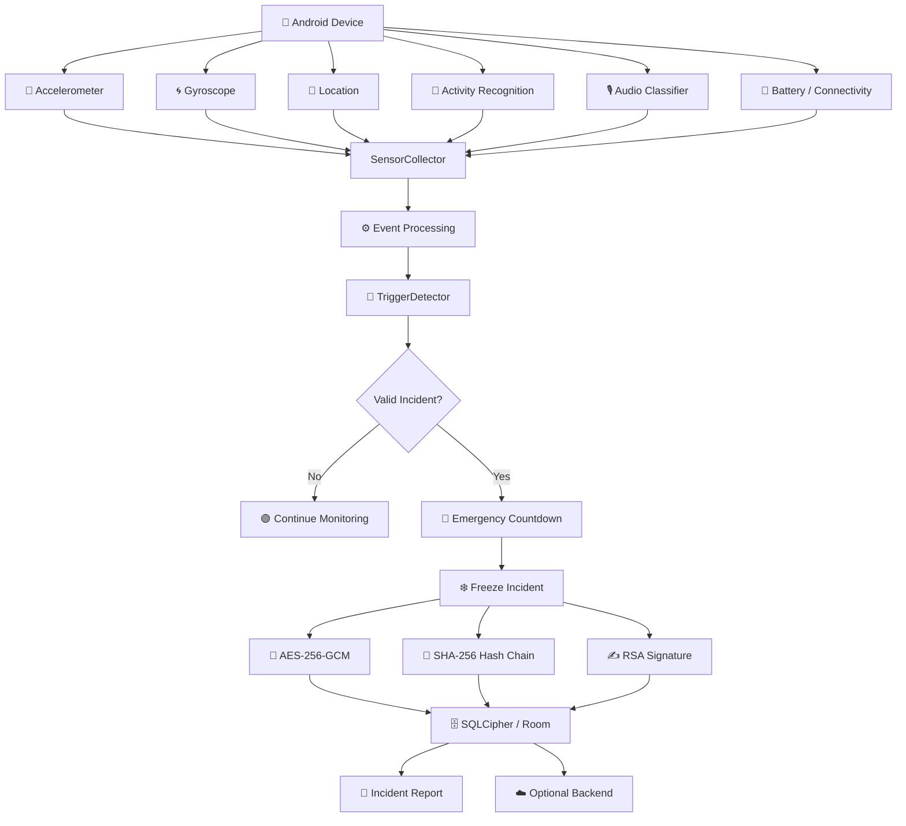
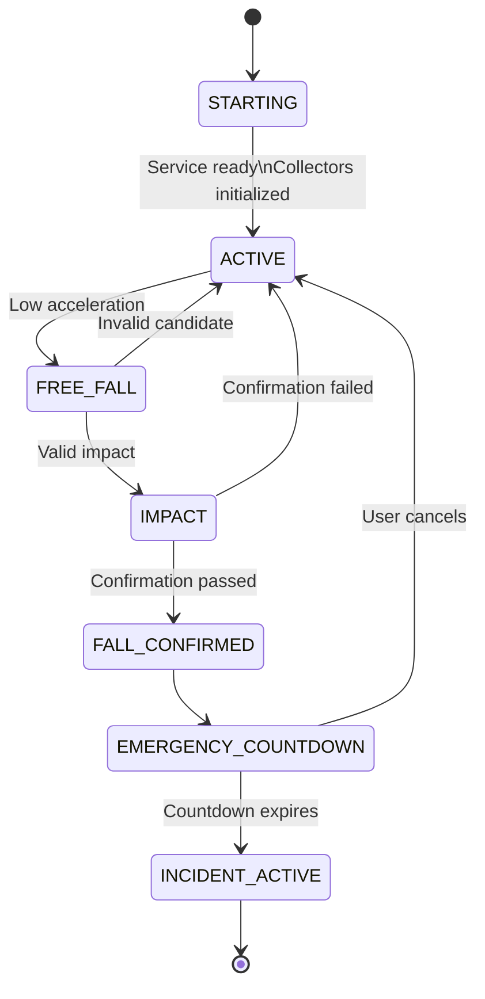

<div align="center">

# 🚨 TRACE

### `PERSONAL SAFETY • DIGITAL BLACK BOX`


<br>


<br><br>


<br><br>

> **A privacy-focused Android safety system inspired by an aircraft black box.**
>
> **It continuously observes context, detects abnormal events, preserves incident evidence, and protects that evidence cryptographically.**

</div>

---

<div align="center">

## ⚡ `SENSE → DETECT → CONFIRM → PROTECT → RECONSTRUCT`

```text
        📡 SENSOR STREAMS
                │
                ▼
       🧠 EVENT PROCESSING
                │
                ▼
       🚨 INCIDENT DETECTION
                │
                ▼
       ✅ MULTI-SIGNAL CONFIRMATION
                │
                ▼
       ⏱️ EMERGENCY COUNTDOWN
                │
                ▼
       ❄️ INCIDENT FREEZE
                │
                ▼
       🔐 ENCRYPTION + INTEGRITY
                │
                ▼
       📄 INCIDENT REPORT
```

</div>

---

# 🛰️ What Is TRACE?

TRACE is designed for one specific question:

> **What happens when the person who needs help cannot use their phone?**

Traditional safety workflow:

```text
User notices emergency
        ↓
Unlock phone
        ↓
Open app
        ↓
Press SOS
        ↓
Communicate
```

TRACE moves the model toward:

```text
Phone is already protecting
        ↓
Sensor context is continuously observed
        ↓
Abnormal event detected
        ↓
Multiple conditions are validated
        ↓
Emergency countdown begins
        ↓
Incident is frozen
        ↓
Evidence is encrypted + integrity protected
        ↓
Incident can be reconstructed later
```

---

# 🌌 The TRACE Philosophy

<div align="center">

### `NORMAL`

🟢 **Observe**

⬇️

### `SUSPICIOUS`

🟡 **Evaluate**

⬇️

### `CONFIRMED`

🔴 **Protect**

⬇️

### `INCIDENT`

🔐 **Preserve Evidence**

</div>

TRACE is not designed to permanently store everything.

Instead:

```text
NEW DATA
   │
   ▼
┌─────────────────────────┐
│     ROLLING CONTEXT     │
│                         │
│     Recent history      │
│                         │
└─────────────────────────┘
   │
   ├──────────────► OLD DATA AGES OUT
   │
   ▼
INCIDENT DETECTED
   │
   ▼
CONTEXT FROZEN
   │
   ▼
SECURED INCIDENT
```

---

# 🚨 Core Features

<table>
<tr>
<td width="50%">

### 🧠 Intelligent Detection

- Automatic fall detection
- Crash detection
- Multi-stage validation
- Gyroscope confirmation
- Impact analysis
- False-positive rejection
- Candidate ownership

</td>

<td width="50%">

### 🆘 Emergency Handling

- Manual SOS
- Automatic emergency countdown
- Safety check-in
- Emergency contacts
- Incident activation
- Incident-time contact snapshot

</td>
</tr>

<tr>
<td>

### 📡 Continuous Context

- Accelerometer
- Gyroscope
- Location
- Activity recognition
- Audio classification
- Battery state
- Connectivity context

</td>

<td>

### 🔐 Evidence Security

- SQLCipher
- AES-256-GCM
- Android Keystore
- SHA-256 hash chain
- Root integrity hash
- RSA signing
- Sanitized logging

</td>
</tr>

<tr>
<td>

### 📊 Incident Reconstruction

- Timeline
- Incident history
- Integrity verification
- Evidence playback
- PDF export
- Protected incident context

</td>

<td>

### ⚙️ Reliability

- Foreground service
- WorkManager
- Hilt dependency injection
- Nonblocking sensor persistence
- Memory optimization
- Explicit protection states

</td>
</tr>
</table>

---

# 🏗️ System Architecture



---

# 🧩 Android Architecture

```text
┌───────────────────────────────────────────────────────────────┐
│                         TRACE APP                            │
├───────────────────────────────────────────────────────────────┤
│                                                               │
│                         🎨 UI LAYER                           │
│                                                               │
│        Status • Timeline • Incidents • More                  │
│                                                               │
├───────────────────────────────────────────────────────────────┤
│                                                               │
│                     🛡️ PROTECTION LAYER                       │
│                                                               │
│             Foreground Service                               │
│             ProtectionStateManager                            │
│                                                               │
├───────────────────────────────────────────────────────────────┤
│                                                               │
│                    📡 SENSOR LAYER                            │
│                                                               │
│ Accelerometer • Gyroscope • Location • Activity • Audio      │
│                                                               │
├───────────────────────────────────────────────────────────────┤
│                                                               │
│                    🧠 DETECTION LAYER                         │
│                                                               │
│ TriggerDetector • Candidate Token • Physics Validation       │
│ Temporal Validation • Emergency State Machine                │
│                                                               │
├───────────────────────────────────────────────────────────────┤
│                                                               │
│                     🗄️ DATA LAYER                             │
│                                                               │
│ Repository • Room • SQLCipher                                │
│                                                               │
├───────────────────────────────────────────────────────────────┤
│                                                               │
│                    🔐 SECURITY LAYER                          │
│                                                               │
│ Android Keystore • AES-GCM • SHA-256 • RSA Signature         │
│                                                               │
├───────────────────────────────────────────────────────────────┤
│                                                               │
│                   ⚙️ BACKGROUND LAYER                         │
│                                                               │
│ WorkManager • Maintenance • Integrity Verification            │
│                                                               │
└───────────────────────────────────────────────────────────────┘
```

---

# 📡 Sensor Intelligence

| Signal | Purpose | Role |
|---|---|---|
| 📈 Accelerometer | Acceleration magnitude | Primary fall/impact signal |
| 🌀 Gyroscope | Angular rotation | Confirmation evidence |
| 📍 Location | Position/context | Incident reconstruction |
| 🏃 Activity Recognition | Walking/running/vehicle | Context + adaptive behavior |
| 🎙️ Audio Classification | Environmental sound | Additional context |
| 🔋 Battery | Power state | Power-aware operation |
| 📶 Connectivity | Network state | Delivery context |

---

# 🚨 Fall Detection Engine

TRACE does **not** use:

```text
HIGH ACCELERATION = FALL
```

That would generate many false positives.

Instead:

```text
             FREE-FALL
                 │
                 ▼
          ≥ 200 ms VALID
                 │
                 ▼
              IMPACT
                 │
                 ▼
         TEMPORAL VALIDATION
                 │
                 ▼
      GYRO / KINETIC CONFIRMATION
                 │
                 ▼
          FALL CONFIRMED
                 │
                 ▼
       EMERGENCY COUNTDOWN
```

---

## 🟢 Stage 1 — Free Fall

Current detector gate:

```text
Acceleration < 1.8 m/s²
Duration     ≥ 200 ms
```

A tiny acceleration dip is not enough.

---

## 🟠 Stage 2 — Impact

Current impact requirement:

```text
Acceleration ≥ 24.0 m/s²
```

The impact must also occur within the valid timing window:

```text
1 ms ────────────────────────── 600 ms
```

---

## 🔴 Stage 3 — Confirmation

Gyroscope confirmation:

```text
Gyro ≥ 2.0 rad/s
```

Temporal alignment:

```text
-100 ms ──────────────── +600 ms
            IMPACT
```

Strong kinetic evidence can also confirm the event at:

```text
Acceleration ≥ 32.0 m/s²
```

---

# 🧠 Candidate Ownership

Every active fall candidate receives a unique token.

```text
                 CANDIDATE CREATED
                         │
                         ▼
                   UNIQUE TOKEN
                         │
                         ▼
                   FREE-FALL VALID
                         │
                         ▼
                       IMPACT
                         │
                         ▼
                    CONFIRMATION
                         │
                ┌────────┴────────┐
                │                 │
              REJECT            ACCEPT
                │                 │
                ▼                 ▼
          INVALIDATE          FALL CONFIRMED
                │                 │
                ▼                 ▼
              STOP            COUNTDOWN
```

A rejected candidate cannot come back later and trigger an emergency.

---

# 🐛 Engineering Story #1 — The 7 ms Bug

One of the most important discoveries came from a real Android device.

The detector observed:

```text
FREE_FALL_VALID
      ↓
freeFallToImpactMs = 7
      ↓
old minimum = 20 ms
      ↓
REJECTED
```

The interesting part was that the application was observing timestamps using:

```kotlin
System.currentTimeMillis()
```

rather than relying directly on the raw hardware timestamp for the final decision clock.

At high accelerometer callback rates, consecutive observations can be only a few milliseconds apart.

So a real-world:

```text
~7 ms
```

interval was possible.

---

## 🔧 Focused Fix

### Before

```text
20–600 ms
```

### After

```text
1–600 ms
```

The rest of the detector logic was intentionally preserved.

Regression coverage:

| Timing | Expected |
|---:|:---:|
| `7 ms` | ✅ Accepted |
| `0 ms` | ❌ Rejected |
| `601 ms` | ❌ Rejected |

---

# 🐛 Engineering Story #2 — Gyroscope Staleness

A real-device session produced a worrying pattern:

```text
Accelerometer → fresh
Gyroscope     → stale
```

The root cause was not simply "bad sensor hardware."

The collection coroutine could wait for encrypted database persistence.

```text
Sensor Callback
      ↓
Collector
      ↓
Room / SQLCipher
      ↓
WAIT
      ↓
Buffer Pressure
      ↓
Stale Data
```

That could create:

```text
Fresh Accelerometer
+
Old Gyroscope
=
Bad Temporal Evidence
```

---

# ✅ Sensor Persistence Fix

The persistence architecture was changed to:

```text
        ACCELEROMETER
              │
              ▼
        ACCEL CHANNEL
              │
              ▼
       IO CONSUMER
              │
              ▼
         DATABASE


         GYROSCOPE
              │
              ▼
         GYRO CHANNEL
              │
              ▼
       IO CONSUMER
              │
              ▼
         DATABASE
```

Sensor collection uses:

```kotlin
trySend(batch)
```

instead of waiting for database I/O.

Persistence runs through:

```text
Dispatchers.IO
```

---

# 📦 Backpressure Protection

Channels are bounded.

Overflow visibility:

```text
accel_overflows
gyro_overflows
```

Overflow policy:

```text
DROP_OLDEST
```

This means queue pressure is measurable instead of invisible.

Target:

```text
accel_overflows = 0
gyro_overflows  = 0
```

---

# 📈 Real Device Evidence

Long physical testing produced checkpoints such as:

```text
state = ACTIVE

accel_samples ≫ 90,000
gyro_samples   ≫ 90,000

last_accel_age_ms → low
last_gyro_age_ms  → low

accel_overflows = 0
gyro_overflows  = 0
```

The recorded session exceeded:

```text
118,000 sensor samples
```

This provides strong physical evidence that the persistence backpressure issue was substantially mitigated during that session.

---

# 🧯 Emergency State Machine



---

# 🆘 Emergency Sources

```text
             ┌──────────────┐
             │   MANUAL SOS │
             └──────┬───────┘
                    │
             ┌──────▼───────┐
             │ AUTO FALL /  │
             │ CRASH        │
             └──────┬───────┘
                    │
             ┌──────▼───────┐
             │ SAFETY       │
             │ CHECK-IN     │
             └──────┬───────┘
                    │
                    ▼
        ┌─────────────────────────┐
        │ CENTRAL EMERGENCY STATE │
        │         MACHINE         │
        └────────────┬────────────┘
                     │
                     ▼
             ⏱️ COUNTDOWN
                     │
                     ▼
              🚨 INCIDENT
```

The important rule:

> **ONE COUNTDOWN • ONE OWNER • NO DUPLICATE TRIGGERS**

---

# 🔐 Security Architecture

<div align="center">

| Security Layer | Technology |
|---|---|
| 🗄️ Database | SQLCipher + Room |
| 🔒 Incident Encryption | AES-256-GCM |
| 🔑 Key Protection | Android Keystore |
| 🔗 Integrity | SHA-256 Hash Chain |
| 🧬 Integrity Root | Merkle-style Root Hash |
| ✍️ Authentication | RSA Digital Signature |
| 🧹 Deletion | Granular Data Wipe |
| 🛡️ Logging | Sanitized Release Logging |
| ☁️ Transport | HTTPS |

</div>

---

# 🔗 Evidence Hash Chain

```text
H0
 │
 ▼
H1
 │
 ▼
H2
 │
 ▼
H3
 │
 ▼
H4
 │
 ▼
H5
```

Conceptually:

```text
H(n) =
SHA-256(
    previous_hash
    +
    event_data
    +
    timestamp
)
```

Modify an old event:

```text
EVENT MODIFIED
      ↓
HASH CHANGES
      ↓
NEXT HASH CHANGES
      ↓
CHAIN BREAKS
      ↓
⚠️ INTEGRITY FAILURE
```

---

# ✍️ Integrity Root + Signature

```text
EVENTS
   │
   ▼
HASH CHAIN
   │
   ▼
ROOT HASH
   │
   ▼
RSA SIGNATURE
   │
   ▼
VERIFIABLE INTEGRITY METADATA
```

The goal is to make the evidence state explainable instead of simply displaying:

```text
✅ VERIFIED
```

without cryptographic reasoning behind it.

---

# 🔒 Incident Encryption

Incident data is protected using:

```text
AES-256-GCM
```

with incident-specific encryption material.

Key protection is backed by:

```text
Android Keystore
```

Conceptually:

```text
Incident
   │
   ▼
Fresh Data Encryption Key
   │
   ├────────► AES-256-GCM
   │               │
   │               ▼
   │          Encrypted Data
   │
   └────────► Keystore-backed Wrapping
```

---

# 🧾 Privacy Model

TRACE is intentionally built around:

```text
DATA MINIMIZATION
        +
LOCAL PROTECTION
        +
CONTROLLED RETENTION
```

Normal operation:

```text
Recent Context
      ↓
Rolling Buffer
      ↓
Old Context Ages Out
```

Incident:

```text
Detection
   ↓
Freeze Relevant Context
   ↓
Encrypt
   ↓
Integrity Protect
   ↓
Report
```

Raw audio is not intended to become permanent normal-operation evidence; classified sound events are used instead.

---

# 🧹 Data Lifecycle

```text
                    TRACE DATA
                        │
        ┌───────────────┼────────────────┐
        │               │                │
        ▼               ▼                ▼
   NORMAL BUFFER     INCIDENTS       CONTACTS
        │               │                │
        ▼               ▼                ▼
   Rolling data     Protected data   Managed data
        │
        ▼
     AGES OUT
```

Separate destructive actions:

```text
Clear Buffer
     ≠
Delete Incidents
     ≠
Delete Contacts
     ≠
Factory Reset
```

---

# 🧨 Factory Reset Philosophy

Factory reset is designed to remove application-sensitive state such as:

```text
🗄️ Encrypted databases
⚙️ Preferences
🧭 Onboarding state
🎯 Calibration state
🔑 Cryptographic keys
🛡️ Protection state
```

---

# ⚙️ Permission Architecture

TRACE separates core and optional capabilities.

### Core

```text
Accelerometer
     +
Gyroscope
     ↓
Core Fall / Crash Detection
```

### Optional context

```text
Location
Microphone
Activity Recognition
Notifications
```

This prevents denial of one optional permission from automatically disabling the core motion path.

---

# 🧠 Why a Foreground Service?

Continuous protection should not depend on:

```text
User keeping Activity open
```

Instead:

```text
UI
 │
 └────► Foreground Service
               │
               ├── Sensor collection
               ├── Detector
               ├── Protection state
               └── Emergency handling
```

The visible UI is a presentation layer.

The protection system has its own lifecycle.

---

# 📊 Protection Lifecycle

```text
USER ENABLES PROTECTION
          ↓
       STARTING
          ↓
FOREGR. SERVICE STARTED
          ↓
COLLECTORS INITIALIZED
          ↓
DETECTOR READY
          ↓
        ACTIVE
```

The application does not intentionally claim `ACTIVE` before the protection stack is actually ready.

---

# 🧠 Memory & Performance

TRACE previously encountered excessive memory pressure from high-frequency UI updates.

Mitigation included:

```kotlin
.sample(1000L)
```

and:

```kotlin
.distinctUntilChanged()
```

along with more efficient parsing.

This reduces unnecessary UI recompositions and allocations.

Regression scenario:

```text
500 continuous
50 Hz sensor readings
        ↓
Zero heap growth
```

for the tested regression case.

---

# 🧪 Testing Strategy

TRACE separates different validation levels.

```text
┌──────────────────────────────────────┐
│             TEST PYRAMID             │
├──────────────────────────────────────┤
│                                      │
│        📱 Physical Testing           │
│               ▲                      │
│               │                      │
│       🔗 Integration Testing         │
│               ▲                      │
│               │                      │
│        🧪 Unit Testing               │
│               ▲                      │
│               │                      │
│      🧱 Static / Build Checks        │
│                                      │
└──────────────────────────────────────┘
```

---

# ✅ Current Automated Validation

<div align="center">

| Validation | Result |
|---|:---:|
| 🧪 Debug Unit Tests | **66/66 ✅** |
| 🏗️ assembleDebug | **✅** |
| 🔍 lintDebug | **✅** |
| 📦 bundleRelease | **✅** |
| 🧠 Memory Regression | **✅** |
| ⚙️ Worker Tests | **✅** |
| ⏱️ Detector Timing Tests | **✅** |

</div>

---

# 🧪 Detector Regression Matrix

| Scenario | Expected |
|---|:---:|
| Valid free-fall | ✅ |
| Short free-fall | ❌ |
| Impact without candidate | ❌ |
| 7 ms free-fall → impact | ✅ |
| 0 ms delay | ❌ |
| 601 ms delay | ❌ |
| Stale gyro | ❌ |
| Invalid candidate reuse | ❌ |
| Duplicate countdown trigger | ❌ |
| Valid confirmation | ✅ |

---

# 📱 Physical Validation

Real-device testing matters because:

```text
UNIT TEST
   ≠
PHONE HARDWARE
```

Physical validation has demonstrated:

```text
✅ Protection ACTIVE
✅ Continuous accelerometer stream
✅ Continuous gyroscope stream
✅ Low sensor ages
✅ Zero recorded accel queue overflows
✅ Zero recorded gyro queue overflows
✅ Long-running sensor collection
```

---

# ⚠️ Important Validation Boundary

An earlier physical build reached:

```text
FREE_FALL
   ↓
IMPACT
   ↓
CONFIRMATION
   ↓
AUTO_FALL
```

That build also exposed the timestamp problem.

A later physical test exposed:

```text
freeFallToImpactMs = 7 ms
```

The final timing fix changed:

```text
20 ms minimum
```

to:

```text
1 ms minimum
```

The new detector behavior is covered by automated regression tests.

However:

> **The newest automatic-fall build still needs one final controlled physical fall test after the 1 ms timing change before that exact hardware path should be claimed as fully verified.**

---

# ☁️ Backend Status

TRACE contains an HTTPS incident-upload architecture.

The previously configured hostname produced:

```text
UnknownHostException
Unable to resolve host
```

Therefore:

```text
LOCAL DETECTION
      ≠
LIVE CLOUD DELIVERY
```

The correct validation chain is:

```text
DNS
 ↓
HTTPS
 ↓
Authentication
 ↓
Incident Upload
 ↓
Backend Processing
 ↓
Notification
```

Until that succeeds, the backend remains an external dependency.

---

# 🐛 Engineering Problem → Solution

| 🔥 Problem | 🧠 Root Cause | ✅ Solution |
|---|---|---|
| WorkManager failure | DI / initialization mismatch | Hilt worker configuration |
| Main-thread OOM | High-frequency UI updates | Sampling + distinct state |
| Permission mismatch | Permission state assumptions | Capability-based checks |
| Fall state race | Candidate could remain reusable | Token ownership + invalidation |
| Gyro staleness | DB writes blocked sensor flow | Channels + IO consumers |
| 7 ms rejection | Timing boundary too strict | 1–600 ms window |
| Partial integrity issue | Partial view treated as origin | Correct partial verification |
| Cloud failure | Backend DNS issue | Explicit external dependency |

---

# 🧩 Tech Stack

<div align="center">

### 📱 Android


### 🏗️ Architecture


### 🔐 Security


### 🌐 Networking


</div>

---

# 🗂️ Project Structure

```text
TRACE/
│
├── app/
│   └── src/
│       ├── main/
│       │   ├── java/com/example/blackbox/
│       │   │
│       │   ├── data/
│       │   │   ├── database/
│       │   │   ├── repository/
│       │   │   └── model/
│       │   │
│       │   ├── domain/
│       │   │   └── trigger/
│       │   │       └── TriggerDetector.kt
│       │   │
│       │   ├── sensor/
│       │   │   └── SensorCollector.kt
│       │   │
│       │   ├── service/
│       │   │   └── BlackboxForegroundService.kt
│       │   │
│       │   ├── security/
│       │   │   ├── KeyManagementService.kt
│       │   │   └── HashChainManager.kt
│       │   │
│       │   ├── workers/
│       │   │
│       │   ├── ui/
│       │   │
│       │   └── util/
│       │
│       └── test/
│
├── docs/
│   ├── screenshots/
│   ├── architecture/
│   └── reports/
│
├── README.md
└── LICENSE
```

---

# 🖼️ Screenshots

Create:

```text
docs/
└── screenshots/
    ├── home.png
    ├── timeline.png
    ├── incidents.png
    ├── medical-id.png
    ├── analytics.png
    └── settings.png
```

Then display them:

<p align="center">
  
  
  
</p>

<p align="center">
  
  
  
</p>

---

# 🚀 Getting Started

## Requirements

```text
Android Studio
Android SDK
Compatible JDK
Android physical device recommended
```

## Clone

```bash
git clone https://github.com/raviraj82891/TRACE.git
cd TRACE
```

## Build Debug APK

```bash
./gradlew assembleDebug
```

## Run Tests

```bash
./gradlew testDebugUnitTest
```

## Lint

```bash
./gradlew lintDebug
```

## Release Bundle

```bash
./gradlew bundleRelease
```

---

# 🧪 Safe Hardware Testing

Automatic fall detection must only be tested in a controlled environment.

Never deliberately create dangerous situations to test the detector.

Recommended evidence:

```text
Real sensor data
+
Real timestamps
+
Real Android device
+
Logcat
+
Controlled motion
+
Repeatable conditions
```

---

# 📈 Project Status

<div align="center">

| System | Status |
|---|:---:|
| 📱 Android Build | 🟢 Verified |
| 🧪 Unit Tests | 🟢 66/66 |
| 🔍 Lint | 🟢 Passing |
| 📦 Release Bundle | 🟢 Passing |
| 📡 Sensor Collection | 🟢 Physical Evidence |
| 🌀 Gyro Persistence | 🟢 Physical Evidence |
| 🧠 False-Positive Protection | 🟢 Implemented |
| 🔐 Local Encryption | 🟢 Implemented |
| 🔗 Integrity Chain | 🟢 Implemented |
| 🚨 Final Fall Hardware Gate | 🟡 Pending |
| ☁️ Live Backend | 🟡 Pending |
| 🔋 Long Battery Profiling | 🟡 Partial |
| ♿ Full Accessibility Matrix | 🟡 Pending |

</div>

---

# 🧭 Focused Roadmap

```text
PHASE 1
████████████████████████████████████ ✅
Core Android System


PHASE 2
████████████████████████████████████ ✅
Detection + State Machine


PHASE 3
████████████████████████████████████ ✅
Encryption + Integrity


PHASE 4
████████████████████████████████░░░ ⚡
Physical Final Fall Validation


PHASE 5
████████████████████████░░░░░░░░░░░ 🚧
Live Backend Validation


PHASE 6
██████████████████░░░░░░░░░░░░░░░░░ 🔬
Battery + Accessibility Profiling
```

---

# 🧠 Why TRACE Is Technically Interesting

TRACE is not simply a collection of UI screens.

The challenging engineering problems are:

### 📡 High-frequency sensing

Sensor streams can arrive dozens of times every second.

### 🧵 Concurrency

Sensor production and database persistence operate at different speeds.

### ⏱️ Timing

Milliseconds can change the detector decision.

### 🧠 State ownership

Safety flows cannot safely depend on multiple competing state machines.

### 🔐 Cryptography

Incident evidence requires encryption and integrity mechanisms.

### 🕵️ Privacy

A safety system must avoid becoming a surveillance system.

### 📱 Hardware reality

Android devices differ in sensor rates, callbacks, lifecycle behavior and power management.

---

# 💡 Engineering Lessons

### 01 — Sensors are concurrency problems

A correct algorithm can still fail when callbacks are blocked by I/O.

---

### 02 — Timestamps are algorithm inputs

Timestamp handling is not "just logging."

It can directly determine whether an incident is accepted.

---

### 03 — One state needs one owner

Especially when multiple systems can initiate an emergency.

---

### 04 — Real hardware breaks assumptions

A simulated 20 ms interval does not guarantee that every Android device behaves that way.

---

### 05 — Security is a pipeline

```text
Encryption
    +
Key Protection
    +
Integrity
    +
Logging Discipline
    +
Deletion
    +
Backup Control
```

---

### 06 — Verification must be honest

```text
TESTED
VALIDATED
OBSERVED
UNVERIFIED
```

These are not interchangeable words.

---

# 🎓 Viva — Explain TRACE in 30 Seconds

> **TRACE is a privacy-focused Android personal safety application based on a digital-black-box concept. It continuously monitors selected sensor and contextual signals, keeps a rolling history, detects potential falls using a multi-stage accelerometer and gyroscope algorithm, starts an emergency countdown when a fall is confirmed, preserves incident context, and protects the resulting evidence using encrypted storage and cryptographic integrity mechanisms.**

---

# 🎤 Viva Cheat Sheet

### ❓ Why accelerometer?

> To detect low-acceleration free-fall and high-acceleration impact events.

### ❓ Why gyroscope?

> To provide independent angular-motion evidence for confirmation.

### ❓ Why not trigger from one spike?

> Because normal interactions can produce large spikes. TRACE evaluates a sequence instead of one reading.

### ❓ Why foreground service?

> Continuous protection should not depend on the visible Activity remaining open.

### ❓ What caused gyro staleness?

> Database persistence was blocking the sensor collection coroutine and creating backpressure.

### ❓ How was it fixed?

> Sensor persistence was moved behind bounded channels and dedicated IO consumers.

### ❓ What was the 7 ms bug?

> A real device produced a 7 ms observed free-fall-to-impact interval, which the old 20 ms minimum rejected.

### ❓ Why 1 ms?

> It allows a distinct adjacent callback interval while still rejecting an apparent 0 ms timestamp boundary.

### ❓ Why use a candidate token?

> To prevent rejected motion candidates from being reused by later callbacks.

### ❓ Why use AES-GCM?

> It provides authenticated encryption for incident data.

### ❓ Why SQLCipher?

> To protect locally persisted database contents.

### ❓ Why a hash chain?

> To make modification of historical event data detectable.

### ❓ Why is 66/66 not enough?

> Unit tests cannot reproduce all real sensor timing, hardware and lifecycle conditions.

### ❓ What is still pending?

> Final newest-build physical fall validation and live backend verification.

---

# 📚 Technical Glossary

| Term | Meaning |
|---|---|
| **Accelerometer** | Measures device acceleration |
| **Gyroscope** | Measures angular rotation |
| **callbackFlow** | Converts callback APIs into Kotlin Flow |
| **Backpressure** | Producer generates data faster than consumer processes it |
| **Channel** | Coroutine-safe asynchronous queue |
| **DROP_OLDEST** | Removes the oldest queued item when capacity is full |
| **SQLCipher** | Encrypted SQLite implementation |
| **Room** | Android persistence abstraction |
| **Android Keystore** | Platform-backed protected key storage |
| **AES-GCM** | Authenticated encryption algorithm |
| **Hash Chain** | Each event cryptographically depends on the previous event |
| **Foreground Service** | Android mechanism for long-running user-visible work |
| **WorkManager** | Android background work framework |
| **State Machine** | Explicit states and legal transitions |
| **False Positive** | Normal event incorrectly classified as an emergency |
| **False Negative** | Real emergency not detected |

---

# 🌐 Future Vision

```text
                       TRACE
                         │
              ┌──────────┴──────────┐
              │                     │
              ▼                     ▼
       PRE-INCIDENT             POST-INCIDENT
              │                     │
              ▼                     ▼
       Sensor Context          Reconstruction
              │                     │
              ▼                     ▼
          Detection              Timeline
              │                     │
              ▼                     ▼
        Confirmation             Integrity
              │                     │
              └──────────┬──────────┘
                         │
                         ▼
                  PROTECTED INCIDENT
```

The philosophy is simple:

> **Do not collect everything.**
>
> **Preserve the right evidence at the right time.**

---

# 👨‍💻 Author

<div align="center">

## Raviraj Sharma

### BCA (Hons.) — Cyber Security


<br><br>

<a href="https://github.com/raviraj82891">
  
</a>

</div>

---

# 🏁 Final Philosophy

<div align="center">

```text
╔══════════════════════════════════════════════╗
║                                              ║
║            TRACE ENGINEERING                 ║
║                                              ║
║     📡 Sense Carefully                       ║
║                                              ║
║     🧠 Detect Conservatively                 ║
║                                              ║
║     🧵 Process Asynchronously                ║
║                                              ║
║     🔐 Protect The Evidence                  ║
║                                              ║
║     🚨 Make Failure Visible                  ║
║                                              ║
║     📱 Test On Real Hardware                 ║
║                                              ║
║     ✅ Never Pretend Unverified Is Proven    ║
║                                              ║
╚══════════════════════════════════════════════╝
```

### 🚨 TRACE

**PERSONAL SAFETY • INCIDENT DETECTION • PRIVACY • INTEGRITY**

<br>

> **Not just an SOS button.**  
> **A digital black box for the moments that matter.**

</div>

---

<div align="center">


</div>
